# NLP APP (Flutter + Python Backend(FastAPI) - Doğal Dil İşleme Uygulaması)

**NLP APP**, Doğal Dil İşleme (NLP) alanında öğrendiğim kavramları uygulamak ve FastAPI kullanmak amacıyla Flutter ile geliştirdiğim bir mobil uygulamadır.

Uygulama arayüzü Flutter ile geliştirilmiş olup, metin işleme ve model işlemleri Python tarafında yürütülmektedir. FastAPI ile API oluşturuldu.

## Proje Amacı

- Uygulamamızda doğal dil işleme (NLP) tekniklerini kullanarak metinlere çeşitli işlemler uygulayabileme
- Basit kural tabanlı ve/veya makine öğrenmesi tabanlı chatbot geliştirme
- Mobil cihazlarda NLP işlevlerini test etme

---

### Uygulama Görselleri

    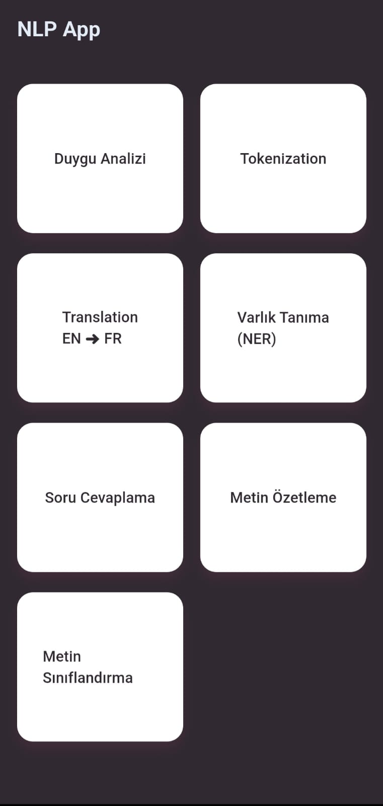
    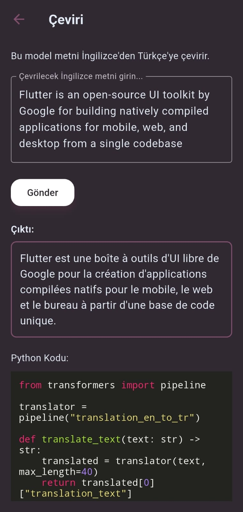
    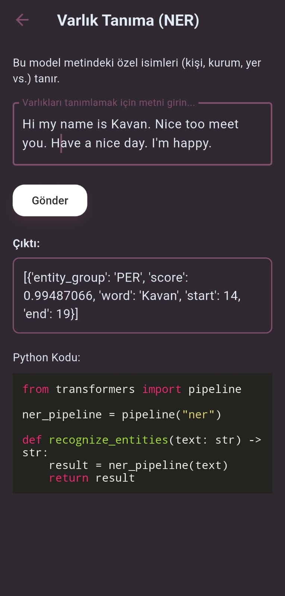
    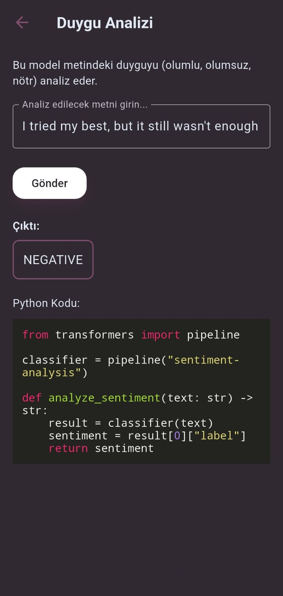
    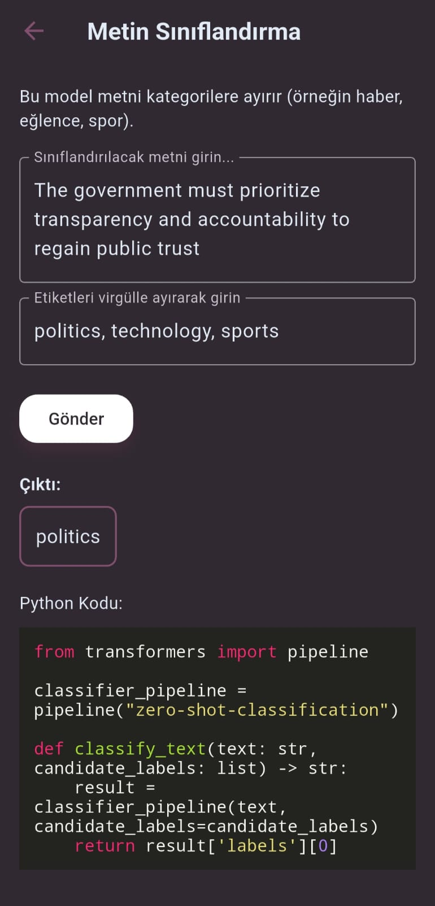
    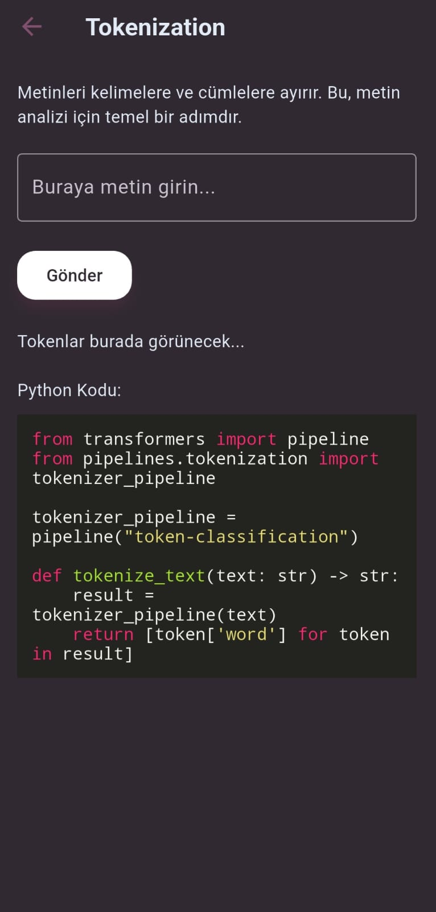
    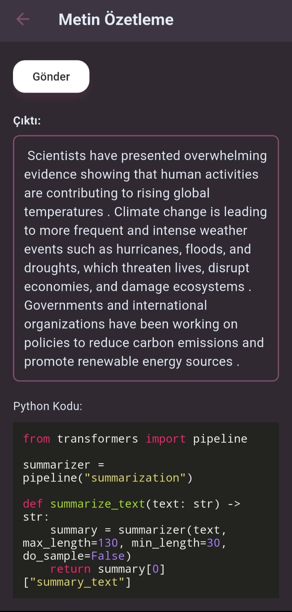
    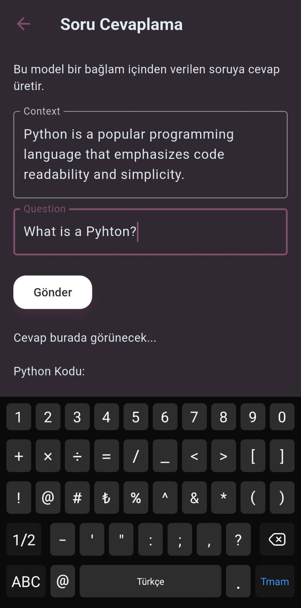

## Postmanden atilan post görselleri ve json yapıları

    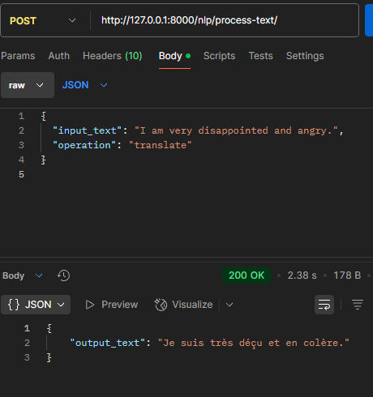
    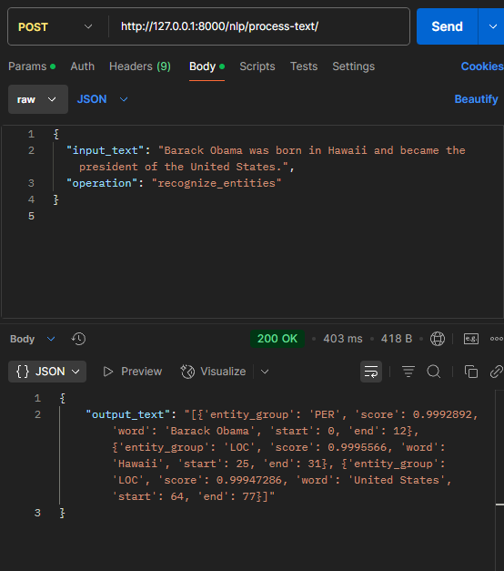
    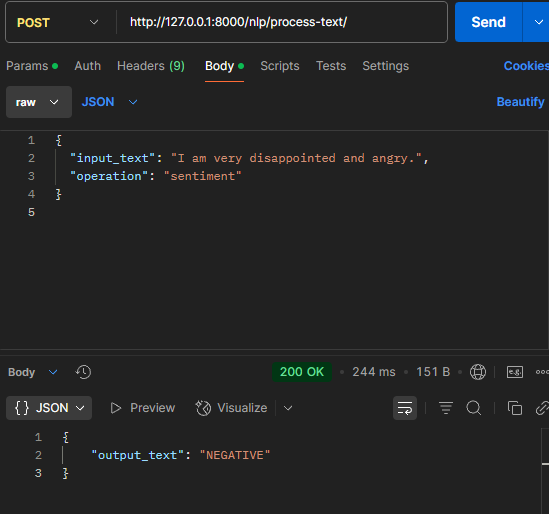
    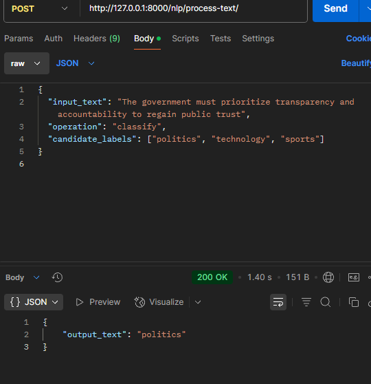
    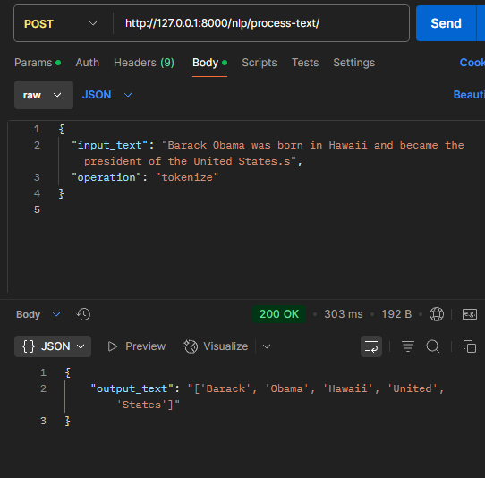
    
    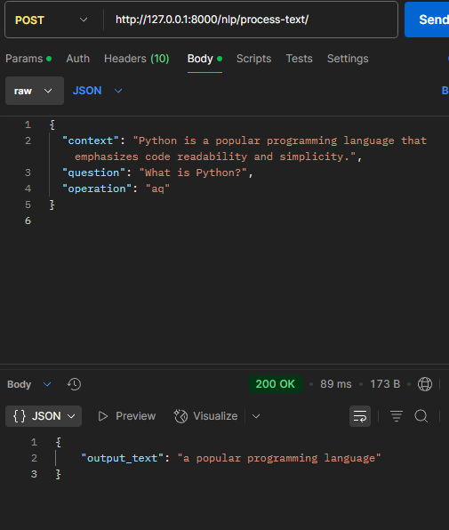

---

## Çeşitli NLP işlemleri

Uygulamamızda doğal dil işleme (NLP) tekniklerini kullanarak metinlere çeşitli işlemler uygulayabiliyoruz. Bu işlemler şunlardır:

Metin Tokenizasyonu: Metni kelimelere veya cümlelere ayırır.

Duygu Analizi: Metindeki olumlu, olumsuz veya nötr duyguları tespit eder.

Çeviri: Metni bir dilden başka bir dile çevirir.

Soru-Cevap: Verilen bir paragraf üzerinden sorulara yanıt üretir.

Varlık Tanıma (NER): Metindeki kişi, yer, kuruluş gibi özel isimleri bulur.

Metin Sınıflandırma: Metni belirli kategorilere ayırır (örneğin spor, ekonomi, sağlık).

Metin Özetleme: Uzun metinleri kısa ve anlamlı özetlere dönüştürür.

---

## 🛠️ Kullanılan Teknolojiler

- **Flutter** (mobil arayüz için)
- **Dart**
- **Python** (NLP işlevleri için)
- **Pipelines, Transformers**
- **Flask veya FastAPI** (Python tarafında API sunmak için)
- **HTTP paketleri (Flutter)**
